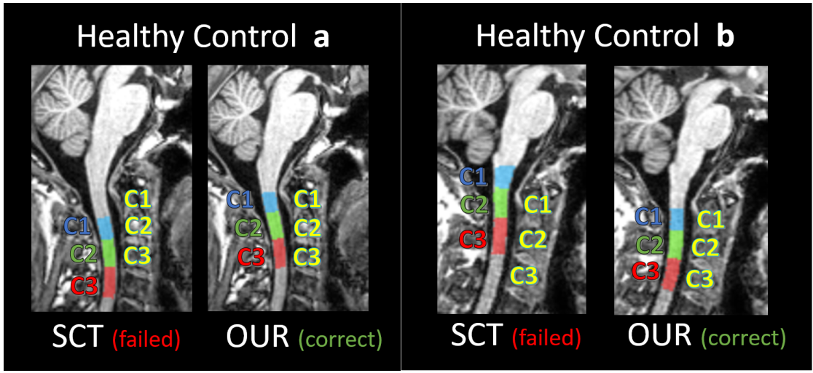
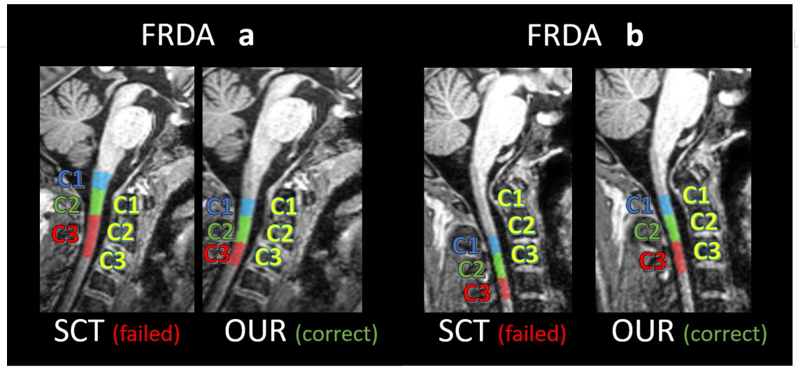

# Anatomical Ground Truth  

In this section, you will find some examples of anatomical reference to compare your results. Please check the images below:    

## Healthy Control

**Comparison of sagittal slices segmentation masks of Healthy Control individuals (a and b) by SCT and our base nnU-Net model. These MRIs examples were not present in the model training or validation sets. First 3 vertebral levels (ground truth levels for C1, C2 and C3 in yellow; segmentation labels generated by SCT and OUR methods are shown in blue, green and red).**  

## FRDA Patients  

  
**Comparison of sagittal slices segmentation masks of FRDA patients (a and b) by SCT and our base nnU-Net model These MRIs examples were not present in the model training or validation sets. First 3 vertebral levels (ground truth levels for C1, C2 and C3 in yellow; segmentation labels generated by SCT and OUR methods are shown in blue, green and red).**

