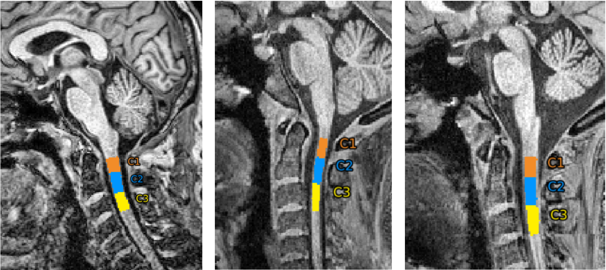
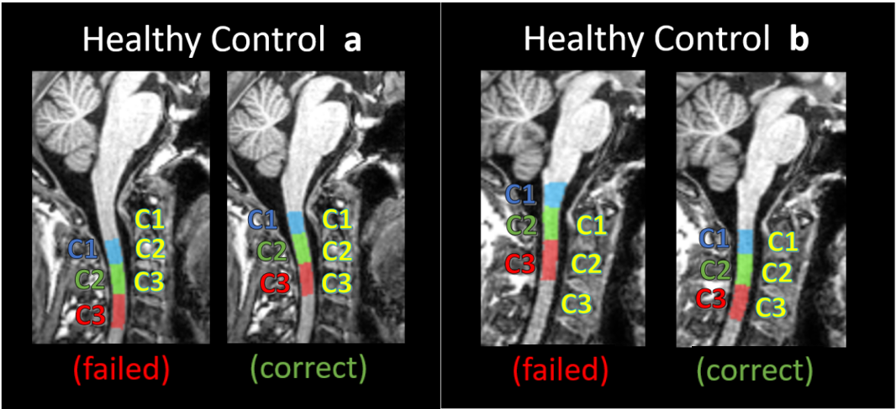
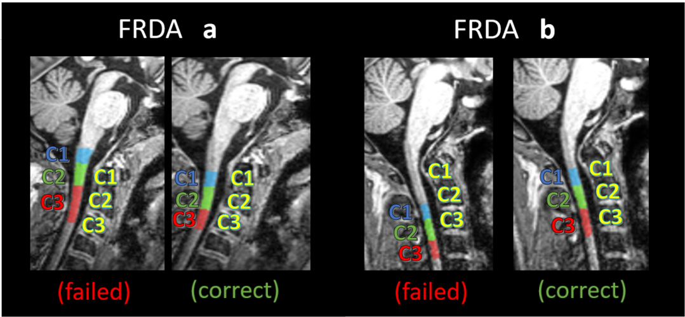
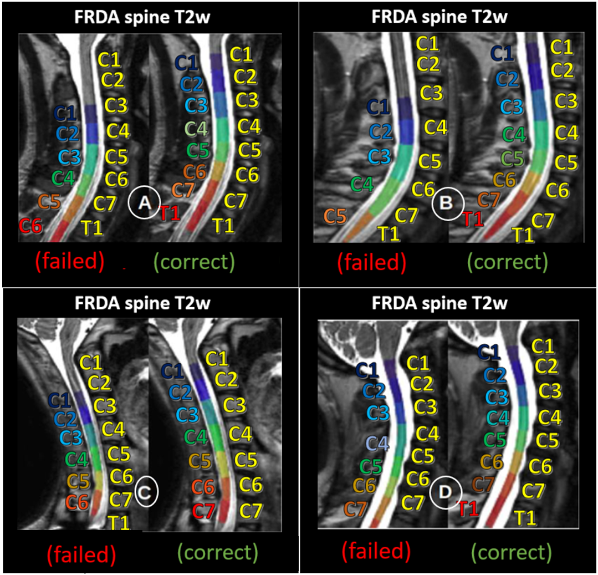

# Anatomical Ground Truth  

In this section, you will find some examples of anatomical references to compare your results. Please check the images below:   

## Landmarks  

  
**Anatomical references for C1, C2 and C3**  

## Healthy Control

**Comparison of sagittal slices segmentation masks of Healthy Control individuals (a and b) by first generation method (failed) and our base nnU-Net model (correct). These MRIs examples were not present in the model training or validation sets. First 3 vertebral levels (ground truth levels for C1, C2 and C3 in yellow; segmentation labels generated by first generation method and our methods are shown in blue, green and red).**  

## FRDA Patients  

  
**Comparison of sagittal slices segmentation masks of FRDA patients (a and b) by first generation method (failed) and our base nnU-Net model (correct). These MRIs examples were not present in the model training or validation sets. First 3 vertebral levels (ground truth levels for C1, C2 and C3 in yellow; segmentation labels generated by first generation method and our methods are shown in blue, green and red).**  

# Future Approach (T1w and T2w lower levels)

On the next version of Enigma-SC, will be included the automatic segmentation of lower vertebral levels (from C1 to T2), including T2w images. This version will be released very soon.  

  

**Comparison of sagittal slices of the vertebral labeling segmentation for different individuals (A, B C and D) with FRDA by first generation method and our base nnU-Net model in T2w images (on the left image of each individual we have the first generation method failed segmentation, and on the right image we have the corrected segmentation generated by our deep-learning based method). The images acquisition was made following the acquisition parameters proposed by the Montreal Protocol (Cohen-Adad et al, 2021). First 8 vertebral levels (ground truth levels in yellow; segmentation labels generated by first generation method and OUR methods are shown in colored index).**

