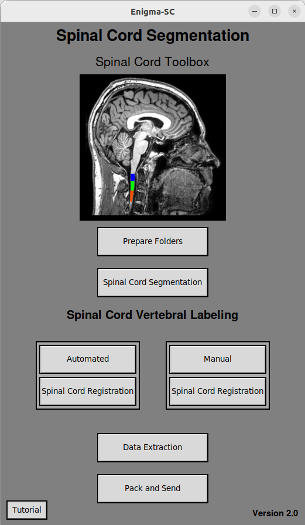

# Enigma-SC
An optimized deep learning-based method for upper spinal cord vertebral labeling.

# What is Enigma-SC ?  
The Enigma Spinal Cord (Enigma-SC) pipeline is a harmonized tool devoted to assess the upper spinal cord acquired on brain T1-weighted images using, mainly, the Spinal Cord Toolbox (SCT, De Leener et al, 2017). Although this newest version encompasses a deep learning algorithm to automatically identify the spinal cord vertebral labels instead of using the automated tool provided by the SCT. This feature has been optimized to deal with severely atrophied and curved spinal cords. 

De Leener B, Lévy S, Dupont SM, Fonov VS, Stikov N, Louis Collins D, Callot V, Cohen-Adad J. SCT: Spinal Cord Toolbox, an open-source software for processing spinal cord MRI data. Neuroimage. 2017 Jan 15;145(Pt A):24-43. doi: 10.1016/j.neuroimage.2016.10.009. Epub 2016 Oct 5. PMID: 27720818.

# How does the Enigma-SC pipeline work ?
Enigma-SC needs brain T1-weighted images covering, at least, C2 vertebral level to work. This pipeline standardizes the computation of cross-sectional area (CSA) and eccentricity provided by the SCT (De Leener et al, 2017) in a fully automated fashion way. The spinal cord vertebral labeling was developed using deep learning algorithms (nnUnet) (Isensee et al., 2020) on a training dataset composed by 293 healthy controls and 293 subjects with molecular confirmation of inherited cerebellar ataxias (41 SCA1, 34 SCA2, 90 SCA3, 14 SCA6 and 114 Friedreich's Ataxia) from 11 sites worldwide (University of Campinas-Brazil, Monash University-Australia, University of Minnesota-USA, RWTH Aachen University-Germany, University of Duisburg-Essen-Germany, University Hospital of Tübingen-Germany, Pitié-Salpêtrière University-France, Universidad Nacional Autonoma de Mexico-Mexico, Federal University of Paraná-Brazil, Fondazione IRCCS Instituto Neurologico Carlo Besta-Italy, Radboud University Medical Center-Netherlands).  

Isensee, F., Jaeger, P. F., Kohl, S. A. A., Petersen, J., & Maier-Hein, K. H. (2020, December 7). nnU-Net: a self-configuring method for deep learning-based biomedical image segmentation. Nature Methods, 18(2), 203–211. https://doi.org/10.1038/s41592-020-01008-z.  

# Getting started

## Read these before you start:    
[Installation Instructions](/Installation%20Instructions.md)




## 1) Running Enigma-SC


Please don't forget to check if you have correctly installed all the requirements listed on [Installation Instructions](/Installation%20Instructions.md) before you run it. After that, you are ready to start.    

To see how to create the **vertebral_labeling.simg** folder correctly, please read the [Installation Instructions](/Installation%20Instructions.md). It will only be necessary if you want to run the predictions via the [Singularity Platform](https://singularity-userdoc.readthedocs.io/en/latest/) or [Apptainer](https://apptainer.org/docs/user/latest/index.html).

To open the **Enigma-SC** interface, open a terminal inside of the **Enigma-SC** folder and type:  

```bash
source venv/bin/activate  
./Enigma-SC.sh
```   
You will see the Enigma-SC interface as shown in the picture above. 

If you are running **Enigma-SC** in a server, or if you couldn`t install all the needed packages to open the GUI, you can run the pipeline via command line, by opening a terminal **inside of the Enigma-SC folder** and typing:  

 ```bash  
./nographmode.sh
```  
Click here to check the [command line tutorial](/command%20line%20TUTORIAL.md)

## 2) Prepare Folders 

The first thing the user should do is to create an output folder. This folder can have any name and be located in any directory. All outputs generated during the processing will be placed inside this folder automatically. 


The **Prepare Folders** button takes all the files inside of the **input** folder, and divides them into differents subfolders into the **OUTPUT** folder created before. This command accepts two different input data formats: single **.nii.gz** files or a **BIDS** dataset. Please refer to the image below how these data are organized.

<p align="center">
  
</p> 

<p align="center">
  
</p> 

By clicking on the **Prepare Folders button** the user will be asked to choose between .nii.gz ou BIDS format files inside of the **input** folder. After your choice, regardless of the format selected by the user, a message will appear in the terminal along with a file dialog box asking you to select your previously created output folder.  

  

After the user selected the output folder, a file dialog box will appear, and you will be able to select your .nii.gz files within your input folder (this folder can have any name) or your BIDS dataset (the anatomical files name must end with T1w.nii.gz). 

  

After the user's selection, the folders will start to be prepared, and a final report will be generated in the terminal indicating whether the process occurred correctly.  

 

Now the output folder will be your **PREPARED FOLDER**, and it will be organized according to the image below.  

 

The next steps can now be executed.  

## 3) Spinal Cord Segmentation 

By clicking on this button, the **Enigma-SC** will run automatically the `sct_deepseg` function of the [Spinal Cord Toolbox](https://spinalcordtoolbox.com/user_section/command-line.html) over each image you selected on the previous step. 

After clicking on the **Spinal Cord Segmentation** button, select the container platform you have installed (Docker or Singularity/Apptainer). Follow the steps on the image below to select all the subfolders inside of the **PREPARED FOLDER** corresponding to the previously selected .nii.gz files, instead of selecting files from the input or BIDS dataset folder. All the files generated by this step, will be placed inside of each individual subfolder inside of the **PREPARED FOLDER** folder.    

  

Once the process is finished, a report will be generated in the terminal informing whether it was successful for each selected file. This report will also be saved in a .txt file within the **PREPARED FOLDER**.  


## 4) Spinal Cord Vertebral Labeling (Automated/Manual)  

The **Vertebral Labeling** can be performed in two ways, either by the **Automated** button or by the **Manual** button. We strongly recommend running the **Automated** button and using the **Manual** button only for those images that show misidentification of the spinal cord levels in the masks generated by the **Automated** vertebral labeling.  

The **Automated** method will predict a segmentation mask for each .nii.gz image, using a [nnunetv2](https://github.com/MIC-DKFZ/nnUNet) model trained from our pipeline according to this [paper](). After that, a seg_labeled.nii.gz file will be created and placed inside of the corresponding folder of each individual inside of the **PREPARED FOLDER**.   

By clicking on the **Automated** button, a small checkbox box will open, and you can choose between [Docker](https://www.docker.com/) or [Singularity](https://singularity-userdoc.readthedocs.io/en/latest/)/[Apptainer](https://apptainer.org/) containerization platforms. If you choose **Docker**, immediately after that, you can select the folders within the **PREPARED FOLDER** that you want to run the **Automated** method on, and then the mask generation process will start. The Linux user password will be requested before initiating the process, unless if you don't have sudo permissions. If you choose **Singularity/Apptainer**, a file dialog box will first prompt you to select the **Enigma-SC** folder on your computer, and after that, you can choose the folders within the **PREPARED FOLDER** folder that you want to run the Automated method on.  


For this step, it is beneficial to run the predictions using GPU, because it will significantly accelerate the the segmentation mask generation process. A GPU (graphics processing unit) is a processor made up of many cores. By working together, the cores can process data faster than a CPU (central processing unit), due to parallel execution of tasks. If you don't have a GPU, the procedure will take longer to complete but can still be done using the CPU. Initially, the [nnunetv2](https://github.com/MIC-DKFZ/nnUNet) model predictions will automatically attempt to perform this task using the GPU. If your GPU is not available for this step, a brief notification will appear everytime a new prediction starts (for each individual you have selected) , and it will automatically switch to the CPU. To check if your GPU has been correctly installed, please check [Installation Instructions](/Installation%20Instructions.md). If you are having GPU related problems, please check [here](/GPU%20related%20problems.md) how to fix it. Also note that GPU used on a shared cluster is generally controlled by a server administrator, so if you are not sure about the presence of a GPU and how to use it, please reach out to your server administrator.  

  

If you choose to run the **Manual** method, for each incorrect segmentation generated by the **Automated** method, simply click the **Manual** button and select, in the file dialog box, all the folders within the **PREPARED FOLDER** folder corresponding to the images you want to correct. Immediately after this, the [Manual Labeling](https://spinalcordtoolbox.com/user_section/tutorials/registration-to-template/vertebral-labeling/manual-labeling-c2c3.html) method of the Spinal Cord Toolbox will start. You will be asked to manually select the location of the C2 and C3 vertebrae (by clicking), for each individual you have selected from the **PREPARED FOLDER** folder.  

Once the labeling process is finished, it is important to check visually (or automatically, following the [QC_SpinalCord](https://github.com/art2mri-user/QC_SpinalCord) pipeline) if the results correspond to the anatomical landmarks. You can check an anatomical reference image to compare your results in the section [Anatomical Ground Truth](/Anatomical%20Ground%20Truth.md). The image below shows how to access the labeled file generated previously.  

  

## 5) Spinal Cord Registration  

For all the images on which you ran the **Automated** method in the previous step, you should run the **Spinal Cord Registration** button located just below the **Automated** button. A file dialog box will appear, and you can follow the same approach from the previous steps to select all corresponding individuals in the **PREPARED** folder. Similarly, for all the images you processed using the **Manual** button, you should run the **Spinal Cord Registration** button located just below the **Manual** button and select all corresponding individuals in the **PREPARED FOLDER**.  

In this step, the [Registration to template](https://spinalcordtoolbox.com/user_section/tutorials/registration-to-template.html) method will be automatically performed for each individual according to the Spinal Cord Toolbox method.  

## 6) Data Extraction  

The main outcome measures of this pipeline are numerical values for Cross-Sectional Area (CSA) and eccentricity, for each participant. The **Data Extraction** button prompts the user to select individuals within the **PREPARED FOLDER** for whom they wish to automatically calculate the Cross Sectional Area and Eccentricity values. Additionally, other morphometric measurements will be computed based on the `sct_process_segmentation` command from the [Spinal Cord Toolbox](https://spinalcordtoolbox.com/user_section/getting-started.html) tutorial.  

Furthermore, two .csv spreadsheets will be generated within the **PREPARED FOLDER**. The first one will be named 'csa_final_table_(mm+dd+yyyy)(hh+mm+ss),' where the information within parentheses corresponds to the date and time of execution, formatted as (month-day-year)(hour-minutes-seconds). The following spreadsheet will be named 'eccentricity_table_(mm+dd+yyyy)_(hh+mm+ss),' following the same format as the previous table. 


In both spreadsheets, you will find the names of all the individuals you selected in the 'subject' column, followed by their respective CSA and Eccentricity values (each in their own spreadsheet). In the 'csa_final_table_' spreadsheet, you will find the CSA values corresponding to each vertebral level (C1, C2, and C3), already corrected for orthogonalization with respect to the anterior-posterior (AP) and right-left (RL) angles, to correct the neck curvature, considering the average as: 

$$
CSA = \frac{{\text{{Mean (area)}} \cdot \cos(\theta_{\text{{AP}}}) + \text{{Mean (area)}} \cdot \cos(\theta_{\text{{RL}}})}}{2}
$$  

<p align="center">
  
</p>  

## 7) Pack and Send   

And finally, the **Pack and Send** button will require the user to (following the same approach as before, of choosing platforms and files) select all individuals folders within the **PREPARED FOLDER** whom they wish to compress into a single .zip file. This will include the output generated throughout the previous steps. The compressed files for each individual will be placed within the **PREPARED FOLDER** (excluding the raw .nii.gz image), and they will be ready to be sent!  


 

