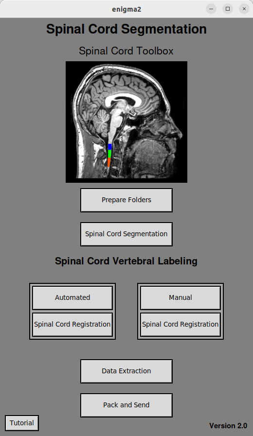

# enigma2
An optimized deep learning-based method for spinal cord vertebral labeling.

# What is enigma2 ?

# How does the enigma2 work ?

# Getting started

Read these before you start:  
[Installation Instructions](/Installation%20Instructions.md)

## 1) Running enigma2

Please don't forget to check if you have correctly installed all the requirements listed on [Installation Instructions](/Installation%20Instructions.md) before you run it. After that, you are ready to start.    

To see how to create the **vertebral_labeling.simg** folder correctly, please read the [Installation Instructions](/Installation%20Instructions.md). It will only be necessary if you want to run the predictions via the [Singularity Platform](https://singularity-userdoc.readthedocs.io/en/latest/).

To open the **enigma2** interface, open a terminal inside of the **enigma2** folder and type `./enigma2.sh`. You will see the enigma2 interface just like in the picture above.

## 2) Prepare Folders 

The first thing the user should do is to create a folder named **input** somewhere and place all desired .nii.gz files inside this folder so that the following steps can be performed. 

The **Prepare Folders** button takes all the files inside of the **input** folder, and divide them in differents subfolders into the **spine** folder which is created automatically outside of the **input** folder.  

By clicking on the **Prepare Folders button** a file dialog box will open, and then you can choose all the .nii.gz files inside of the **input** folder. After that, you are ready to segment them.  

## 3) Spinal Cord Segmentation 

By clicking on this button, the **enigma2** will run automatically the `sct_deepseg` function from the [Spinal Cord Toolbox](https://spinalcordtoolbox.com/user_section/command-line.html) over each image you selected from the previous step.  

But now, after clicking on the **Spinal Cord Segmentation** button, you will select all the folders inside the **spine** folder corresponding to the previously selected .nii.gz images. All the files generated by this step, will be placed inside of each individual folder inside of the **spine** folder.    

## 4) Spinal Cord Vertebral Labeling (Automated/Manual)  

The **Vertebral Labeling** can be performed in two ways, either by the **Automated** button or by the **Manual** button. We strongly recommend running only the **Automated** button and using the **Manual** button only for those images that show misidentification of the spinal cord levels in the masks generated by the **Automated** vertebral labeling.  

The **Automated** method will predict a segmentation mask for each .nii.gz image, using a [nnunetv2](https://github.com/MIC-DKFZ/nnUNet) model trained from our pipeline according to this [paper](). After that, a seg_labeled.nii.gz file will be created and placed inside of each correspondigly folder of each individual inside of the **spine** folder.  

By clicking on the **Automated** button, a small checkbox box will open, and you can choose between [Docker](https://www.docker.com/) or [Singularity](https://singularity-userdoc.readthedocs.io/en/latest/) containerization platforms. If you choose **Docker**, immediately after that, you can select the folders within the **spine** folder that you want to run the **Automated** method on, and then the mask generation process will start. The Linux user password will be requested before initiating the process. If you choose **Singularity**, a file dialog box will first prompt you to select the **enigma2** folder on your computer, and after that, you can choose the folders within the **spine** folder that you want to run the Automated method on.  

For this step, it is crucial that you have a GPU available to run the predictions; the segmentation mask generation process will be significantly accelerated in this situation. If you don't have a GPU, the procedure will take longer to complete but can still be done using the CPU. Initially, the [nnunetv2](https://github.com/MIC-DKFZ/nnUNet) model predictions will automatically attempt to perform this task using the GPU. If your GPU is not available for this step, a brief notification will appear everytime a new prediction starts (for each individual you have selected) , and it will automatically switch to the CPU. To check if your GPU has been correctly installed, please check [Installation Instructions](/Installation%20Instructions.md).    

If you choose to run the **Manual** method, for each incorrect segmentation generated by the **Automated** method, simply click the **Manual** button and select, in the file dialog box, all the folders within the **spine** folder corresponding to the images you want to correct. Immediately after this, the [Manual Labeling](https://spinalcordtoolbox.com/user_section/tutorials/registration-to-template/vertebral-labeling/manual-labeling-c2c3.html) method of the Spinal Cord Toolbox will start. You will be asked to manually click, indicating the location of the C2 and C3 vertebrae, for each individual you have selected from the **spine** folder.  

## 5) Spinal Cord Registration  

For all the images on which you ran the **Automated** method in the previous step, you should run the **Spinal Cord Registration** button located just below the **Automated** button. A file dialog box will appear, and you need to select all corresponding individuals in the **spine** folder. Similarly, for all the images you processed using the **Manual** button, you should run the **Spinal Cord Registration** button located just below the **Manual** button and select all corresponding individuals in the **spine** folder.  

In this step, the [Registration to template](https://spinalcordtoolbox.com/user_section/tutorials/registration-to-template.html) method will be automatically performed for each individual according to the Spinal Cord Toolbox method.  

## 6) Data Extraction  

The **Data Extraction** button prompts the user to select individuals within the **spine** folder for whom they wish to automatically calculate the Cross Sectional Area (CSA) and Eccentricity values. Additionally, other morphometric measurements will be computed based on the `sct_process_segmentation` command from the [Spinal Cord Toolbox](https://spinalcordtoolbox.com/user_section/getting-started.html) tutorial.  

Furthermore, two .csv spreadsheets will be generated within the **spine** folder. The first one will be named 'csa_final_table_(mm+dd+yyyy)(hh+mm+ss),' where the information within parentheses corresponds to the date and time of execution, formatted as (month-day-year)(hour-minutes-seconds). The following spreadsheet will be named 'eccentricity_table_(mm+dd+yyyy)_(hh+mm+ss),' following the same format as the previous table.  

In both spreadsheets, you will find the names of all the individuals you selected in the 'subject' column, followed by their respective CSA and Eccentricity values (each in its own spreadsheet). In the 'csa_final_table_' spreadsheet, you will find the CSA values corresponding to each vertebral level (C1, C2, and C3), already corrected for orthogonalization with respect to the AP and RL angles, considering the average as: 

$$
CSA = \frac{{\text{{Mean (area)}} \cdot \cos(\theta_{\text{{AP}}}) + \text{{Mean (area)}} \cdot \cos(\theta_{\text{{RL}}})}}{2}
$$  

## 7) Pack and Send   

And finally, the **Pack and Send** button will require the user to select all individuals within the **spine** folder whom they wish to compress into a single .zip file. This will include everything generated throughout the previous steps. The compressed files for each individual will be placed within the **spine** folder (excluding the raw .nii.gz image), and they will be ready to be sent!

 

