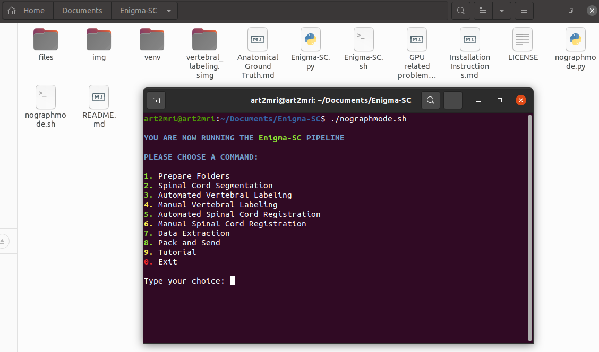

## Command Line Tutorial

### Use this alternative only if you cannot install the GUI for some reason

To visualize the MENU, open a terminal inside of the **Enigma-SC** folder and type: `./nographmode.sh` 

  

The user should follow the numeric sequence of the numbers in green **(1 - 2 - 3 - 5 - 7 - 8)**. The numbers in yellow (4 and 6) only must be triggered in special ocasions (number 4 and 6 only for those images which failed on step number 3 and 5) and number 9 (to open this tutorial page).  

### 1. Prepare Folders  

Before typing this option, the user should create an output folder (you can choose any name, without spaces)
